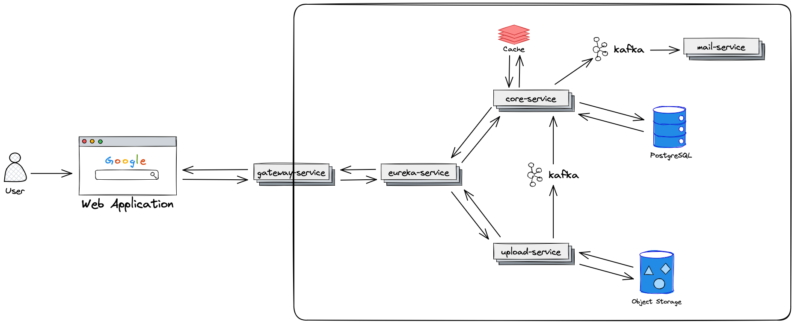

# Diary - electronic diary for colleges and universities built on microservices.

## Built With 

- ### Java 21 
- ### Spring Boot 3
- ### Spring Data
- ### Spring cloud
- ### Spring Security 6
- ### PostgreSQL
- ### Docker

## Architecture


## Features

- ### Event-driven architecture
- ### Send messages with files (with multithreading)
- ### Storing files in Yandex Object Storage
- ### Add marks, groups, schedules and etc

## Getting Started

### 1. Clone the repository
```sh
   git clone https://github.com/Dminin05/Diary-backend.git
```
### 2. Build project
```sh
   ./gradlew build
```
### 3. Docker compose
```sh
   docker compose up
```
